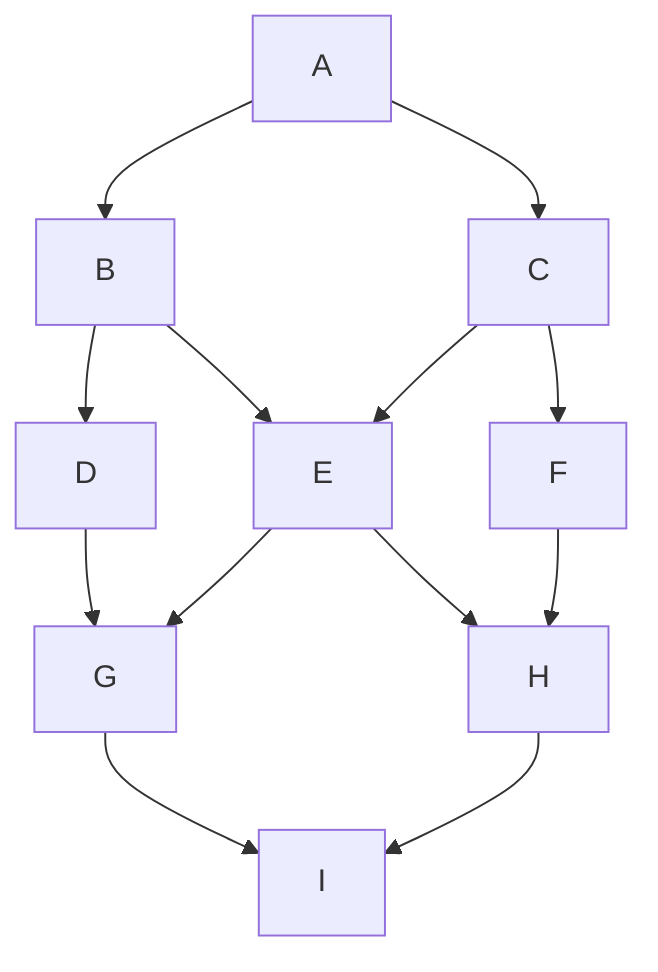

# Markdown notes - H1 heading
## This is an H2 heading
### This is an H3 heading
#### This is an H4 heading
##### This is an H5 heading
###### This is an H6 heading

---

This is normal text

*Asterisks for italics*

_Or underscores_

Double asterisks for **BOLD** text

---

### Lists:

- Pikachu
- Eevie
- Charizard
- Blastoise

1. One
1. Two
1. Three
2. Four

---

This is an  `inline` code block

```JavaScript
Console.log("Triple backticks for code block on own line(s).")
```

---

Link with [text](https://www.google.co.uk/)

#### Image


---

> This is a comment
>> about life
>>> the universe 
>>>> and beyond

---

#### Table

Name | Age
--- | ---
Yasir | 29
Mohammed | 28
Abdullah | 26

---

#### Checklist

- [x] Yes
- [ ] No

---

#### Flowcharts




